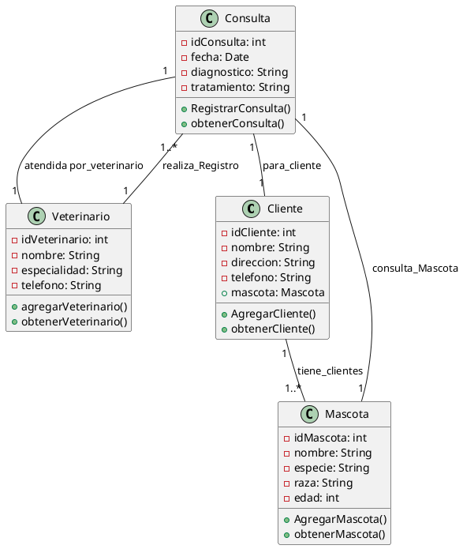

# Sistema de Gestión de Consultas Veterinarias

Este proyecto se centra en la creación de un sistema para la gestión de consultas veterinarias, permitiendo registrar, modificar, eliminar y visualizar consultas de forma eficiente. El sistema está implementado con Angular para el frontend, Spring Boot para el backend y MySQL como base de datos.

## 1. Requerimientos del Sistema de Consultas

### Requerimientos Funcionales

- **RF01:** El sistema debe permitir registrar nuevas consultas veterinarias para cada mascota, asociadas a un cliente y a un veterinario.
- **RF02:** El sistema debe permitir modificar los detalles de una consulta existente (fecha, diagnóstico, tratamiento).
- **RF03:** El sistema debe permitir eliminar consultas.
- **RF04:** El sistema debe permitir listar todas las consultas por mascota o por veterinario.
- **RF05:** El sistema debe permitir buscar consultas por fecha, cliente, veterinario o tipo de tratamiento.

### Requerimientos No Funcionales

- **RNF01:** El sistema debe ser accesible desde cualquier dispositivo con navegador web.
- **RNF02:** El sistema debe soportar hasta 1000 consultas simultáneas sin afectar el rendimiento.
- **RNF03:** El sistema debe cumplir con las normativas de seguridad para el manejo de datos sensibles (información de clientes y mascotas).

## 2. Mockups (Consultas)

**link de Figma**
---
https://www.figma.com/design/zAxZRxDTPyKkI6B86EXP4w/Untitled?node-id=1-6&node-type=frame&t=ZzMOvHsuF1Y3QqbL-0

---

- **Pantalla de Registro de Consulta:** Formulario para ingresar los datos de la consulta (mascota, cliente, veterinario, diagnóstico, tratamiento).
- **Pantalla de Lista de Consultas:** Vista donde se muestran todas las consultas registradas, con filtros por veterinario, cliente o fecha.
- **Pantalla de Detalles de Consulta:** Vista con los detalles completos de una consulta seleccionada, con opción para editar o eliminar.

## 3. Modelo Entidad-Relación (MER) / Modelo Relacional (MR) / Diccionario de Datos

### Modelo Entidad-Relación (MER)

- **Entidad Consulta:** Registra las consultas realizadas.
  - **Atributos:** id_consulta, fecha, diagnostico, tratamiento

### Modelo Relacional (MR)

| Tabla         | Campos                                                                                       |
|---------------|----------------------------------------------------------------------------------------------|
| **Consulta**  | id_consulta (PK), fecha, diagnostico, tratamiento, id_mascota (FK), id_cliente (FK), id_veterinario (FK) |

### Diccionario de Datos

- **Consulta**
  - **id_consulta:** Identificador único de la consulta.
  - **fecha:** Fecha de la consulta.
  - **diagnostico:** Diagnóstico del veterinario.
  - **tratamiento:** Tratamiento prescrito durante la consulta.
  - **veterinario:** Nombre del veterinario que atendio

## 4. UML (Consultas)

### Diagrama de Clases (Consultas)

#### Clases:

- **Consulta**

#### Relaciones:
- Cada consulta depende de una mascota, un veterinario y un cliente. `Entonces`
- Cliente "1" -- "1..*" Mascota : clientes

``Un Cliente puede tener una o más Mascotas.``

- Veterinario "1" -- "1..*" Consulta : realiza_Registro

``Un Veterinario puede realizar el registro de uno o más Consultas.`` 

- Consulta "1" -- "1" Mascota : consulta_Mascota

``Cada Consulta está asociada a una sola Mascota.``

- Consulta "1" -- "1" Cliente : para_cliente

``Cada Consulta está destinada a un solo Cliente.`` 

- Consulta "1" -- "1" Veterinario : atendida por_veterinario

``Cada Consulta es atendida por un solo Veterinario``

### Diagrama de Actividades (Flujo de Registro de Consultas)

´´´plantuml

@startuml
|Veterinario|
start
:Introducir datos de consulta;
|Controlador|
:Recibir datos;
|Servicio|
:Guardar datos en la base de datos;
stop
@enduml

´´´

### Diagrama de Secuencia (Registro de Consulta)

´´´plantuml 
@startuml
actor "Veterinario" as Vet
participant "Controlador" as Ctrl
participant "Servicio" as Serv
participant "Repositorio" as Repo

Vet -> Ctrl : Introducir datos de consulta
Ctrl -> Serv : Pasar datos de consulta
Serv -> Repo : Guardar consulta
Repo --> Serv : Confirmación de guardado
Serv --> Ctrl : Confirmación de guardado
Ctrl --> Vet : Confirmación de registro
@enduml

´´´

#### Secuencia:
1. - El veterinario introduce los datos.
2. - El controlador recibe los datos y los pasa al servicio.
3. - El servicio los guarda en la base de datos a través del repositorio.

## 5. Arquitectura

### Arquitectura en Capas del Sistema

#### Capa de Presentación (Frontend)
- **Angular:** Desarrollar la interfaz gráfica para gestionar consultas, donde los veterinarios puedan registrar y visualizar consultas.

#### Capa de Negocio (Backend)
- **Spring Boot:** Implementar los servicios RESTful que manejan las operaciones de CRUD (Crear, Leer, y Eliminar) sobre las consultas.

#### Capa de Datos
- **Base de Datos MySQL:** Almacenar las consultas y sus relaciones con clientes, mascotas y veterinarios.

## 6. MVP (Angular - Spring Boot)

### Backend (Spring Boot)

#### Servicios REST para Consultas:
- `GET /api/consultas`: Listar todas las consultas.
- `POST /api/consultas`: Registrar una nueva consulta.
- `DELETE /api/consultas/{id}`: Eliminar una consulta.

### Frontend (Angular)

#### Componentes:
- **ConsultaListComponent:** Muestra la lista de consultas registradas.
- **ConsultaFormComponent:** Formulario para registrar o editar una consulta.

#### Servicios:
- **ConsultaService:** Servicio que se comunica con la API REST del backend para manejar las consultas.
